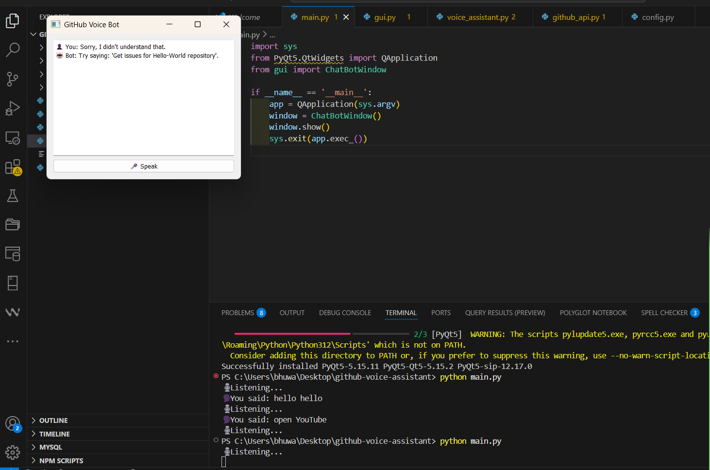

# GitHub Voice Assistant

This project is a voice-activated assistant that interacts with GitHub using Python and PyQt5.

## Features

- Voice command input
- GitHub integration
- GUI interface using PyQt5

## Screenshot



## Installation

Make sure you have Python and the required packages installed:

```bash
pip install -r requirements.txt
